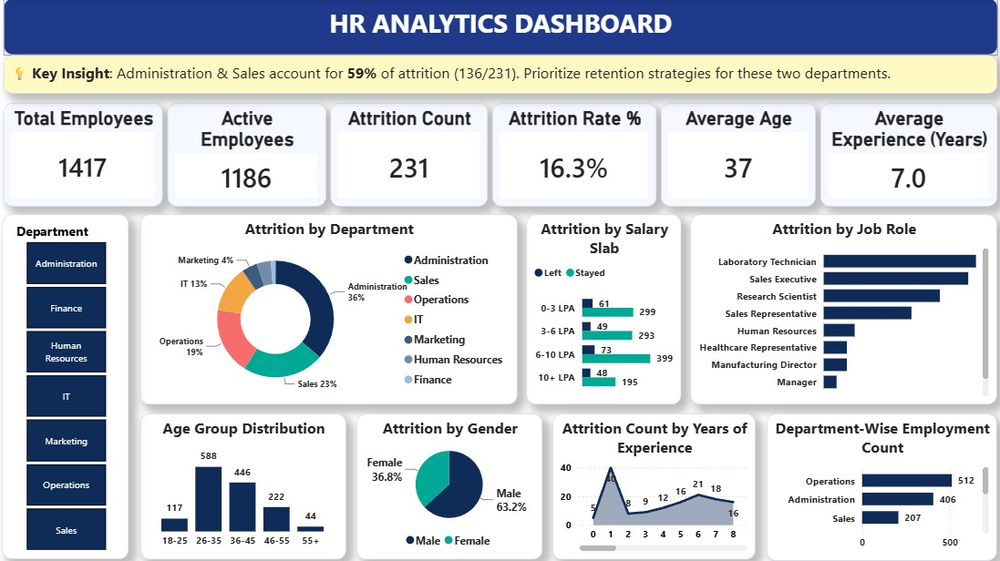

# HR Analytics Dashboard

An interactive HR Analytics Dashboard built using Power BI to analyze employee attrition and workforce trends.

## 📊 Project Overview

This dashboard provides insights into employee attrition based on department, gender, job role, salary slab, and years of experience.

## 📊 Dashboard Preview

## 🎯 Objectives

- Analyze overall employee attrition
- Identify departments with higher attrition
- Understand attrition by gender and job role
- Analyze attrition across salary slabs
- Analyze attrition based on years of experience
- Support data-driven HR retention strategies

## 📌 Key KPIs

- Total Employees
- Active Employees
- Attrition Count
- Attrition Rate
- Average Age
- Average Experience

## 🔍 Key Insight

Administration & Sales account for 59% of total attrition (136/231). Prioritize retention strategies for these two departments.

## 🛠️ Tools Used

- Power BI
- DAX
- CSV

## 📁 Files

- `HR_Analytics.pbix` — Power BI dashboard
- `HR_Analytics_Dashboard.png` — Dashboard preview
- `HR_Analytics_Data.csv` — Dataset

## 📈 Dashboard Analysis

The dashboard allows users to explore employee attrition patterns using interactive filters and visualizations.

---

**Created using Microsoft Power BI**
